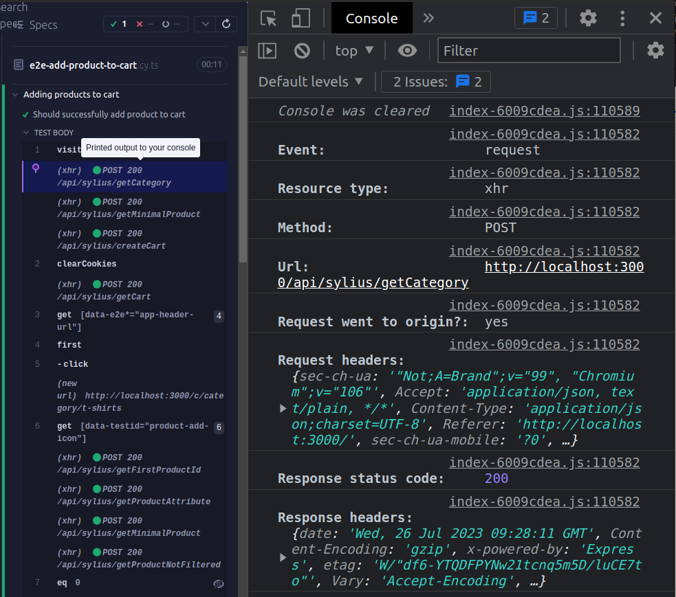
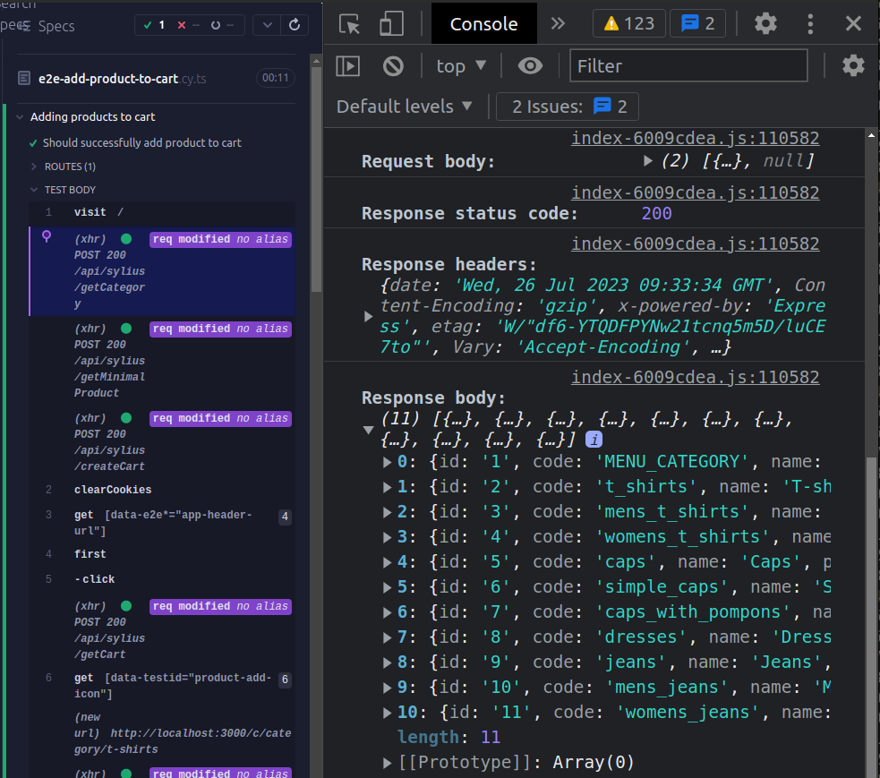

# Testing - Mocking api data for tests

## Introduction

We use Cypress for end to end testing. It is a great tool for testing, it allows us to mock data, but we need to intercept api calls manually and there is a lot of them. We don't want to test our api in end to end tests, we want to test only our application. To solve this problem we created a simple solution.

:::tip Tests separation concept

VSF2 is a headless application. It means that it's frontend is separated from backend api but it highly depends on responses provided by it.

We want to separate our tests from backend api. We don't want to test our api in end to end tests. We want to test only our application. To do this **we need to mock data from api**. We can do this **by intercepting api calls** and returning mock data. This way we can test our application without backend api running.

This is important because we don't want our tests to fail when backend api fails. Backend api has it's own tests and if something breakes there it should not affect our tests.

:::

## Preparation

Before we start we need to create our test using real backend api. This way we don't have to do anything to make test work, at least while backend api is running. It will be used later to create mock data for our tests.

:::warning Github actions
End to end tests are run on Github automatically when merging to one of main branches. We need to make sure that our tests have mock data to pass on Github actions. Backend api is not running on Github actions therefore **it will always fail if we don't mock data**.

**To test it locally just turn off backend api and run tests** after we add mock data. If tests pass then we are good to go.
:::

**Example test:**
_`packages/theme/tests/e2e/-file-name.cy.ts`_

```ts
import page from '../pages/factory';

context('Adding products to cart', () => {
  it(['e2e', 'happypath'], 'Should successfully add product to cart', () => {
    // Go to category page
    page.home.visit();
    page.home.header.categories.first().click();

    // Add product
    page.category.addProductToCart(0);

    // Check cart sidebar content
    page.category.header.openCartSidebar();
  });
});
```

This test is going to work only with real backend api running.

## Getting api data manually

> This might help you understand how mock data is generated automatically and used. If you are not intrested in this you can skip to [next section](#automatic-mock-data-generation).

To get api responses in Cypress tests we can use [`cy.intercept()`](https://docs.cypress.io/api/commands/intercept) command. This command is used to intercept requests. It's very simple to use. We also have custom command `cy.interceptApi()` to make it even simpler for our use case, but more on that later.

### Why do we need to intercept api calls?

We need to intercept api calls to get data from them. By default you can see api calls in Cypress console but you can't get response data from them. To get data we need to intercept them.

**Running spec using `yarn test` without adding `cy.intercept()`, backend is working**<br>
(Note that there is no response body in console)



### Intercepting all api calls

Now let's intercept all api calls. We need to add `cy.intercept()` command to our test.

We will use it like that `cy.intercept('POST', '/api/sylius/**', (req) => {});`.

Every our api call in cypress is made using `POST` method and starts with `/api/sylius/` so we can use it to intercept all api calls. Only url ending is different, so we use `**` to match any ending.

By adding `(req) => {}` at the end, even though we don't do anything with our requests, it causes Cypress to also show api responses in console.

It should not affect how our test works in any way yet.

:::tip Cypress interceptions
Note that `cy.intercept()` is going to apply for all api calls after this command that match path and method. It can be overwritten by another `cy.intercept()` command at any time.

This will be important later when we want to mock data for specific api calls.
:::

**Test with added interception for all api calls**

```ts
import page from '../pages/factory';

context('Adding products to cart', () => {
  it(['e2e', 'happypath'], 'Should successfully add product to cart', () => {
    cy.intercept('POST', '/api/sylius/**', (req) => {});
    // Go to category page
    page.home.visit();
    page.home.header.categories.first().click();

    // Add product
    page.category.addProductToCart(0);

    // Check cart sidebar content
    page.category.header.openCartSidebar();
  });
});
```

**Cypress output:**<br>
(Response body is now visible in console)



Now we can see api response body in console. We can use that to create mock data manually by simply copying it. However, it's not very convenient. We need to copy data from console and paste it to our mock data file, then reapeat for every single api call. It's also easy to make a mistake.

This is why we created custom commands to generate mock data file automatically.

## Automatic mock data generation

This works similarly to mannualy getting api data calls but it also **automatically saves api responses in proper format to variable and a to file at the end.** It's very simple to use. We just need to add two commands to our test.

To generate mock data automatically we need to use custom `cy.dataAutogenIntercept()` and `cy.dataAutogenSaveToFile()` commands.

#### `dataAutogenIntercepts(apiData: Record<string, unknown>): Chainable<Record<string, unknown>>;`

This command intercepts all api calls, saves api response data in proper format and returns it. It should be used like that **at the beginning of our test**:

```ts
let apiDataGen = {};
cy.dataAutogenIntercept(apiDataGen).then((newData) => {
  apiDataGen = newData;
});
```

First we create empty object `apiDataGen` that will be used to store our mock data. Then we pass it to `cy.dataAutogenIntercept()` command. This way `apiDataGen` will be updated with every api call. It will be used later to save mock data to file.

This by itself can also be used to display api response body in console while using `yarn test` and will not affect how our test works.

#### `cy.dataAutogenSaveToFile(apiData: Record<string, unknown>, fileName: string): void;`

This command saves mock data to file. It should be used **at the end of our test**. This one is straight forward. We just pass `apiDataGen` object containing our api responses and file name to it (it should be same as our test file name, without extension, as it is added automatically).

```ts
cy.dataAutogenSaveToFile(apiDataGen, 'my-test-file-name');
```

### Using both commands in practice to generate mock data

Now let's use both commands together to generate mock data. We need to add `cy.dataAutogenIntercept()` command at the beginning of our test and `cy.dataAutogenSaveToFile()` at the end. Nothing else is needed.

```ts
import page from '../pages/factory';

context('Adding products to cart', () => {
  it(['e2e', 'happypath'], 'Should successfully add product to cart', () => {
    let apiDataGen = {};
    cy.dataAutogenIntercept(apiDataGen).then((newData) => {
      apiDataGen = newData;
    });

    // Go to category page
    page.home.visit();
    page.home.header.categories.first().click();

    // Add product
    page.category.addProductToCart(0);

    // Check cart sidebar content
    page.category.header.openCartSidebar();

    cy.dataAutogenSaveToFile(apiDataGen, 'my-test-file-name');
  });
});
```

Now we can run our test and mock data file will be generated automatically.

:::warning Remember
Run your test with real backend api while generating mock data. After generating data, remove data generation commands from your test. Otherwise mock data file will be overwritten every time you run your test. If it is already mocked or partially mocked, it will not generate any data but it will overwrite existing data with empty object.
:::

After generating data **run prettier to format it properly.**

```bash
yarn prettier --write "packages/theme/tests/e2e/fixtures/api/[my-file-name].ts"
```

You can use this command **to run test and format mock data file** automatically (although you can run test in any way you want) just replace `[my-test-file-name]` with your file name without extension:

```bash
fileName=[my-test-file-name] && yarn test:hl --spec "integration/$fileName.cy.ts" && yarn prettier --write "packages/theme/tests/e2e/fixtures/api/$fileName.ts"
```

:::warning Updating mock data
When you update your test you need to update mock data file as well. Otherwise it might stop working, or behave differently than expected. Repeat steps from above to update mock data.
:::

## Generated mock data format

Generated data is saved in _`packages/theme/tests/e2e/fixtures/api/`_ directory. It is saved as `my-test-file-name.ts` file (name is same as one provided in `cy.dataAutogenSaveToFile()`). It has to be formatted by prettier to be readable.

> It is not necessary to know how mock data looks like and how it is generated, but it might be useful if you have to debug something. If you are not interested in this you can go to [next section](#using-generated-mock-data-in-tests) where it is shown how to use generated mock data in tests.

Data structure is predefined by our custom commands and it should look like this:

```ts
// Predefined object containing all api calls responses
const apiData = {
  // Name of object property is generated from url part after /sylius/, for example:
  // http://localhost:8000/api/sylius/getCart
  // is converted to "getCart"
  getCart: [
    {
      // Response data from call 1
      // Responses are ussualy objects{} or arrays[]
    },
    // If there is more than one call to the same api endpoint
    // (http://localhost:8000/api/sylius/getCart)
    // it will be added as another object in array
    {
      // Response data from call 2
    },
  ],
  // Other api call
  // http://localhost:8000/api/sylius/getCategory
  // Note that it is always saved as array,
  // even if there is only one call/one response,
  // it is done to keep it consistent and convinient to use
  getCategory: [
    {
      // Response data from call 1
    },
  ],
};

// Export data
export default apiData;
```

This format lets us use data in our tests easily. Autocompletion should work as well, so we can see all available api responses, and we don't have to know what is inside `apiData` object. You will see why this is so convinient later.

After importing `apiData` object we can get single api response like that:

```ts
import apiData from 'my-test-file-name';

// Response 1 from getCart api call
apiData.getCart[0];
// Response 2 from getCart api call
apiData.getCart[1];
// Response 1 from getCategory api call
apiData.getCategory[0];
```

Practical use of this data is shown in next section.

## Using generated mock data in tests
